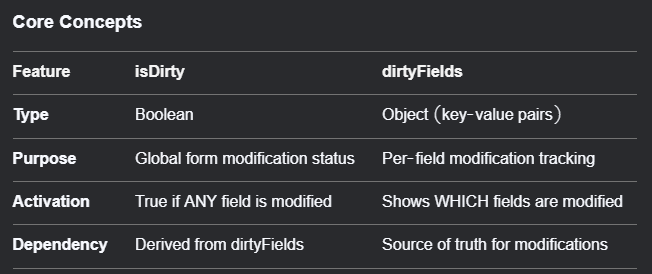

# Differences between isDirty and dirtyFields

## `isDirty`

`isDirty` is a boolean that indicates whether any field in the entire form has been modified. If even one field is dirty, `isDirty` becomes `true`. So `isDirty` is like a global flag for the form's dirtiness, while `dirtyFields` gives granular information about each field.

 `isDirty` is derived from `dirtyFields`. Essentially, `isDirty` is `true` if `dirtyFields` has any keys. So if `Object.keys(dirtyFields).length > 0`, then `isDirty` is `true`.

## `dirtyFields`

`dirtyFields` is an object that tracks which specific fields have been modified from their initial/default values. Each key in `dirtyFields` corresponds to a field name, and its value is a boolean indicating if that field is dirty. For example, if the user changes the 'email' field, `dirtyFields.email` becomes `true`.

## `defaultValues`

React Hook Form requires `defaultValues` to be set for `isDirty` and `dirtyFields` to work correctly. If a form doesn't have default values, these properties might not behave as expected. That's an important point to mention.

## How does reverting work?

If the user changes a field and then changes it back, does it still count as dirty? Yes, because the current value matches the default, but since it was modified, `dirtyFields` remains `true` until the form is reset. No, actually, in React Hook Form, `dirty` is determined by whether the current value is different from the default. So if you change a field and then change it back, `dirtyFields` for that field becomes `false` again.

According to React Hook Form documentation, a field is considered dirty if its current value is different from the default value. So if you modify a field and then revert it, it's no longer dirty. Therefore, `dirtyFields` would update accordingly. That's an important detail to clarify.

## Special mention

I should also mention that `isDirty` is a computed property based on `dirtyFields`, so it's efficient to use `isDirty` when you don't need to know which fields are dirty, just whether any are.

Also, mention that `isDirty` is a top-level property, while `dirtyFields` is an object, so accessing them differs.

## Edge cases

What if the form has no default values? Then `isDirty` and `dirtyFields` might not work as expected because they rely on initial values to compare against. So it's important to set `defaultValues` when using these features.

## Conclusion

### The key differences are

- `isDirty` is a boolean indicating if any field is dirty.

- `dirtyFields` is an object indicating which specific fields are dirty.

- Use `isDirty` for overall form state, `dirtyFields` for per-field state.



## Example

```jsx
import { useForm } from "react-hook-form";
import { DevTool } from "@hookform/devtools"
const ProfileForm = () => {
    const { register, control, formState: { isDirty, dirtyFields } } = useForm({
        defaultValues: {
            name: 'Alice',
            email: 'alice@example.com',
            phone: '+1234567890'
        }
    });


    return (
        <>
            <div className={`max-w-lg mx-auto p-6 bg-white rounded-lg shadow-md ${isDirty ? 'border border-green-400' : 'border border-gray-200'
                }`}>
                {/* Name Field */}
                <div className="mb-4">
                    <label className="block text-gray-700 mb-2">Name</label>
                    <input
                        {...register('name')}
                        className={`w-full p-3 border rounded-lg ${dirtyFields.name ? 'border-green-400 bg-green-50  outline-none' : 'border-gray-300'
                            }`}
                    />
                    {dirtyFields.name && (
                        <span className="text-green-600 text-sm mt-1">Unsaved changes</span>
                    )}
                </div>

                {/* Email Field */}
                <div className="mb-4">
                    <label className="block text-gray-700 mb-2">Email</label>
                    <input
                        {...register('email')}
                        className={`w-full p-3 border rounded-lg ${dirtyFields.email ? 'border-green-400 bg-green-50 outline-none' : 'border-gray-300'
                            }`}
                    />
                    {dirtyFields.email && (
                        <span className="text-green-600 text-sm mt-1">Unsaved changes</span>
                    )}
                </div>

                {/* Save Button */}
                <button
                    type="submit"
                    disabled={!isDirty}
                    className={`w-full py-3 rounded-lg font-bold ${isDirty
                        ? 'bg-green-500 hover:bg-green-600 text-white'
                        : 'bg-gray-200 text-gray-400 cursor-not-allowed'
                        }`}
                >
                    Save Changes
                </button>
            </div>
            <DevTool control={control} />
        </>
    );
};

export default ProfileForm;

```
